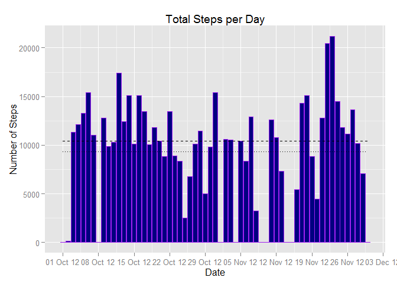
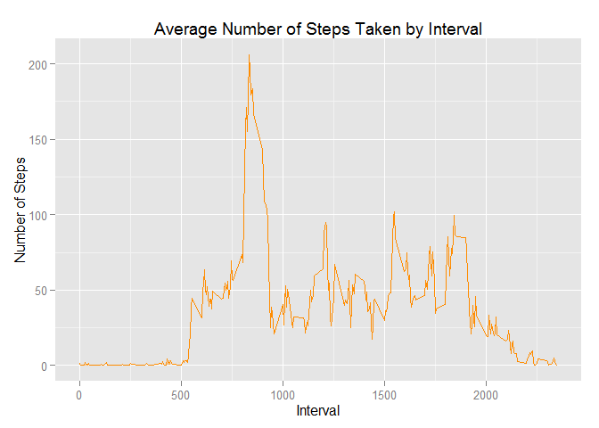
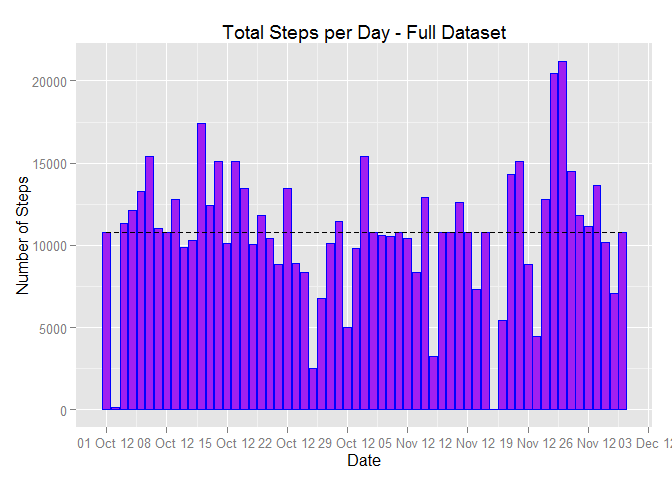
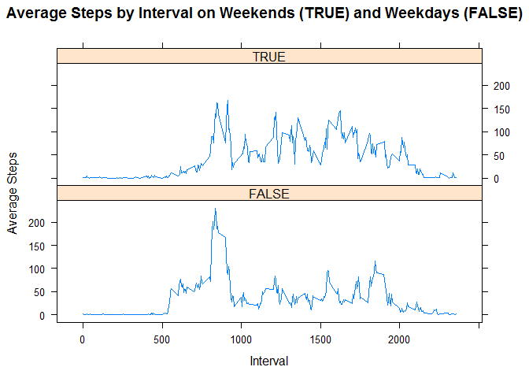

# Rep. Research Peer Assessment 1

## Ensuring Packages Are Loaded

```r
library(knitr)
library(ggplot2)
library(scales)
```

```
## Warning: package 'scales' was built under R version 3.2.2
```

```r
library(lattice)
opts_chunk$set(echo = TRUE)
```

## Loading and preprocessing the data
  We need to load the data and make it suitable for our analysis. 

```r
## Loading Data
ActivityData <- read.csv("activity.csv", header = TRUE, sep = ",", stringsAsFactors = FALSE)

##Editing columns into necessary formats
ActivityData$date <- as.Date(ActivityData$date)
ActivityData$steps <- as.numeric(ActivityData$steps)
ActivityData$interval <- as.numeric(ActivityData$interval)
```

## What is mean total number of steps taken per day?
  First, we must calculate the total number of steps taken per day.

```r
ActivityDataByDate <- aggregate(ActivityData$steps, by = list(ActivityData$date),FUN = sum, na.rm = TRUE)
##Label the axes
names(ActivityDataByDate) <- c("date", "steps")
head(ActivityDataByDate,3)
```

```
##         date steps
## 1 2012-10-01     0
## 2 2012-10-02   126
## 3 2012-10-03 11352
```
  Now we can create a histogram of the total number of steps taken each day

```r
ggplot(ActivityDataByDate, aes(x = date, y = steps)) + 
    geom_bar(stat = "identity", fill = "navyblue", color="purple", binwidth = 2000) + 
    labs(title = "Total Steps per Day", x = "Date", y = "Number of Steps") +
    scale_x_date(breaks = date_breaks("1 week"),
                 labels = date_format("%d %b %y")) +
    geom_line(stat="hline", yintercept=mean, linetype="dotted") +
    geom_line(stat="hline", yintercept=median, linetype="dashed")
```

 
  
  Finally, we can calculate and report the mean and median of the total number of steps taken per day

  The mean of the total number of steps taken each day, or the y-value of the dotted line on the graph

```r
mean(ActivityDataByDate$steps)
```

```
## [1] 9354.23
```

  The median of the total number of steps taken each day, or the y-value of the dashed line on the graph

```r
median(ActivityDataByDate$steps)
```

```
## [1] 10395
```

## What is the average daily activity pattern?

  Make a time series plot (i.e. type = "l") of the 5-minute interval (x-axis) and the average number of steps taken, averaged across all days (y-axis)

```r
## Aggregate Average Steps by Interval
ActivityDataByInterval <- aggregate(ActivityData$steps, by = list(ActivityData$interval),FUN = mean, na.rm = TRUE)

## Label the axes
names(ActivityDataByInterval) <- c("interval","steps")

## Use ggplot2 to build the time series plot
ggplot(ActivityDataByInterval, aes(x = interval, y = steps)) + 
    geom_line(color = "darkorange") + 
    labs(title = "Average Number of Steps Taken by Interval", x = "Interval", y = "Number of Steps")
```

 
  
  Which 5-minute interval, on average across all the days in the dataset, contains the maximum number of steps?

```r
MaxSteps <- which.max(ActivityDataByInterval$steps)
```
  This interval...

```r
ActivityDataByInterval[MaxSteps, ]
```

```
##     interval    steps
## 104      835 206.1698
```

## Imputing missing values
  
  Let's calculate and report the total number of missing values in the dataset.

```r
missingValues <- which(is.na(ActivityData$steps))
length(missingValues)
```

```
## [1] 2304
```
  
  We can create a new dataset that is equal to the original dataset but with the missing data filled in. We can then go through the new dataset in a loop and replace each missing value with a mean for that five-minute interval.

```r
FullData <- ActivityData
for(i in missingValues) {
    FullData$steps[i] <- ActivityDataByInterval[which(ActivityDataByInterval$interval == FullData[i, "interval"]), "steps"]
}
```
  
  Now we'll re-calculate the aggregate number of steps per day...

```r
FullDataByDate <- aggregate(FullData$steps, by = list(FullData$date),
                            FUN = sum, na.rm = TRUE)
names(FullDataByDate) <- c("date", "steps")
```
  ...and use that to construct a new histogram of the total numbers of steps taken each day

```r
ggplot(FullDataByDate, aes(x = date, y = steps)) + 
    geom_bar(stat = "identity", fill = "purple", color="blue", binwidth = 2000) + 
    labs(title = "Total Steps per Day - Full Dataset", x = "Date", y = "Number of Steps") +
    scale_x_date(breaks = date_breaks("1 week"),
                 labels = date_format("%d %b %y")) +
    geom_line(stat="hline", yintercept=mean, linetype="dotted") +
    geom_line(stat="hline", yintercept=median, linetype="dashed")
```

 
 
  The mean of the total number of steps taken each day, or the y-value of the dotted line on the graph

```r
mean(FullDataByDate$steps)
```

```
## [1] 10766.19
```

  The median of the total number of steps taken each day, or the y-value of the dashed line on the graph

```r
median(FullDataByDate$steps)
```

```
## [1] 10766.19
```
  These values do indeed differ from the estimations based upon the original dataset with missing values. By replacing the missing values with the previously calculated averages, the sums would have to rise, inevitably driving the overall mean and median up.
  
## Are there differences in activity patterns between weekdays and weekends?

  We need to create a new factor variable in the dataset with two levels - "weekday" and "weekend" indicating whether a given date is a weekday or weekend day.First, we transform the full dataset to include a new boolean factor variable. weekend is TRUE for weekends and FALSE for weekdays.

```r
FullData <- transform(FullData, isWeekend=as.POSIXlt(date)$wday %in% c(0, 6))
```
   We then aggregate means of steps factored by both interval and weekend/weekdays variables.

```r
FullDataByDay <- aggregate(FullData$steps, by = list(FullData$interval, FullData$isWeekend), FUN = mean)
## Label columns
names(FullDataByDay) <- c("interval","isWeekend","steps")
```
  Finally, we make a panel plot of the average number of steps taken by intervals on weekends (marked as TRUE) and weekdays (marked as FALSE).

```r
xyplot(steps ~ interval|isWeekend, data = FullDataByDay,
       type = "l", layout=c(1, 2),
       main = "Average Steps by Interval on Weekends (TRUE) and Weekdays (FALSE)",
       xlab = "Interval", ylab = "Average Steps")
```

 
